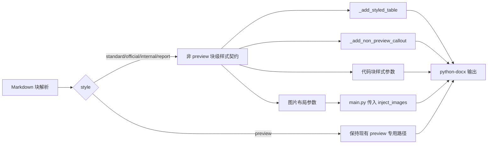

# DOCX 非预览样式优化实施计划

> **给智能体执行者：** 必须使用 `superpowers:subagent-driven-development`（推荐）或 `superpowers:executing-plans` 按任务执行。实施前先完成任务 0；本计划只优化 `standard`、`official`、`internal`、`report` 四种非 `preview` 样式，不重构 `preview` 渲染路径。

**目标：** 在不回退 `preview` 的前提下，提升 `standard`、`official`、`internal`、`report` 四种 DOCX 样式的表格、图片、提示块、代码块和段落节奏质量。

**架构：** 保留 `DOCX_PRESETS` 继续负责页面、标题、正文主样式；新增仅覆盖非 `preview` 的块级样式契约。`preview` 保持当前专用路径和硬编码视觉常量，作为稳定基线；四种非 `preview` 样式通过新函数和显式参数接入，避免和 `preview` 的 `table_mode/code_mode` 双轨混用。

**技术栈：** Python 3.12、FastAPI、python-docx、lxml、pytest、LibreOffice 命令行转换、Docker full 镜像。

---

## 一、评审后修订原则

本版吸收架构、UX、QA、Codex、Claude 评审意见，做出以下修订：

1. 本期不把 `preview` 接入新块级契约，不修改 `_generate_preview_from_content`、`_add_table(mode="preview")`、`_add_preview_callout` 的既有行为。
2. 不把 `app.image_injector` 反向耦合到完整样式表；图片注入只接收调用方传入的图片布局参数。
3. 不在 `_add_table` 内叠加 `mode` 与 `table_style` 双轨判断；新增 `_add_styled_table` 专供非 `preview` 样式使用。
4. `official` 下的 blockquote 不默认等同于“注”。只有明确以 `注意：`、`说明：`、`注：` 或 GFM alert 开头的提示内容才规范为 `注：`；普通引用保留为引用段落。
5. API 层无效样式继续返回 `400 STYLE_INVALID`；只有 `generate_docx_from_content` 直接调用时保持回退到 `standard`。
6. 真实文档测试脚本参数化，不硬编码个人路径；个人真实目录只作为本机手动参数。
7. Docker full 联调和本地 `uvicorn` 联调拆开，验收证据必须可归档。

## 二、范围边界

### 本期范围

- `/convert` 通过 `generate_docx_from_content` 生成的 DOCX。
- `standard`、`official`、`internal`、`report` 四种非 `preview` 样式。
- 表格：宽度、边框、表头、字号、单元格边距、表后间距。
- 图片：按样式限制最大宽度，按样式设置段前段后。
- 提示块：区分普通引用与提示说明。
- 代码块：9pt、单倍行距、样式化底色。
- 自动化测试、真实 Markdown 样张、DOCX/PDF 视觉证据。

### 本期不做

- 不重构 `preview` 生成路径。
- 不改变客户端样式选择 UI。
- 不改变 `/convert` 请求字段。
- 不改变 `STYLE_ORDER` 和样式 ID。
- 不承诺 Word/WPS/Pages 像素级一致，只要求版心、字号、图表、表格、提示块稳定可读。
- `generate_standard_docx(title, messages, ...)` 消息格式函数保持 legacy 行为；本期只保证不回退，不作为样式优化主路径。

## 三、用户选择指南

| 样式 | 用户心智 | 优化重点 |
| --- | --- | --- |
| `standard` 通用 Word | 普通 Word 交付和后续编辑 | 表格清晰、图片不超版心、代码块稳定 |
| `official` 正式公文 | 通知、请示、报告等正式公文材料 | 保留公文正文体系，表格和提示不网页化 |
| `internal` 机关内部 | 内部流转材料，稳重但比正式公文更易读 | 紧凑表格、浅灰提示、图表留白 |
| `report` 调研报告 | 数据、图表、分析结论较多的报告 | 表格可读、图表居中、提示说明清晰 |

## 四、当前问题

```text
                                  非 preview DOCX 观感不稳
                                                  |
        +----------------------+------------------+-------------------+------------------+
        |                      |                                      |                  |
      表格                    图片                                  提示块              验收
        |                      |                                      |                  |
  默认 Table Grid       非 preview 未限宽                    引用和提示混用           缺少可归档证据
  表头不清晰            图表可能超出版心                      公文提示网页化           人工“看起来像”
  单元格边距不可控       图片段落间距单一                      普通引用可能误转注       Docker 与本地混淆
  宽表列宽不可控        reference 模板可能冲突                 多段引用未定义           样本路径不可复现
        |
      代码块
        |
  基础 9pt 单倍行距已有
  但未按非 preview 样式形成契约和验收
```

## 五、目标效果线框图

### `standard` 通用 Word

```text
+--------------------------------------------------------------+
|                         文档标题                              |
|                                                              |
| 二级标题                                                     |
| 正文保持当前通用 Word 主体观感。                              |
|                                                              |
| +----------------+----------------+----------------+         |
| | 浅灰表头        | 浅灰表头        | 浅灰表头        |         |
| +----------------+----------------+----------------+         |
| | 内容 9.5pt      | 内容 9.5pt      | 内容 9.5pt      |         |
| +----------------+----------------+----------------+         |
|                                                              |
| [代码块：浅灰底、9pt、单倍行距]                              |
|                                                              |
|                 [图表不超过 15.5cm]                          |
+--------------------------------------------------------------+
```

### `official` 正式公文

```text
+--------------------------------------------------------------+
|                   方正小标宋简体 二号标题                      |
|                                                              |
| 一、黑体三号一级标题                                          |
|     正文仿宋_GB2312 三号，固定 28 磅行距，两端对齐。           |
|                                                              |
|          +----------+----------+----------+                  |
|          | 表头加粗 | 表头加粗 | 表头加粗 |                  |
|          +----------+----------+----------+                  |
|          | 五号内容 | 五号内容 | 五号内容 |                  |
|          +----------+----------+----------+                  |
|                                                              |
|     注：仅明确提示内容才规范为注。普通引用不改写语义。          |
+--------------------------------------------------------------+
```

### `internal` 机关内部

```text
+--------------------------------------------------------------+
|                       机关内部文件标题                         |
|                                                              |
| 一、一级标题                                                  |
|     正文宋体，整体稳重，表格比正式公文更适合扫描。              |
|                                                              |
| +----------------+----------------+----------------+         |
| | 浅灰表头        | 浅灰表头        | 浅灰表头        |         |
| +----------------+----------------+----------------+         |
| | 紧凑内容        | 紧凑内容        | 紧凑内容        |         |
| +----------------+----------------+----------------+         |
|                                                              |
| [内部提示块：浅灰底、无强装饰、字号略小]                      |
+--------------------------------------------------------------+
```

### `report` 调研报告

```text
+--------------------------------------------------------------+
|                         调研报告标题                           |
|                                                              |
| 1. 报告章节标题                                               |
| 报告正文强调图表、表格和说明文字的连续阅读。                   |
|                                                              |
| +----------------------+------------+------------+            |
| | 报告表头              | 指标       | 结论       |            |
| +----------------------+------------+------------+            |
| | 数据内容              | 123        | 风险较高    |            |
| +----------------------+------------+------------+            |
|                                                              |
|                 [图表居中，不超过 15.8cm]                    |
|                                                              |
| [提示块：报告说明/风险提示，浅灰底，边距清晰]                 |
+--------------------------------------------------------------+
```

## 六、设计方案



### 文件职责

- `app/presets.py`
  - 保留 `DOCX_PRESETS`、`STYLE_ORDER`、`VALID_STYLES`。
  - 新增非 `preview` 块级样式数据结构。
  - 新增 `NON_PREVIEW_BLOCK_STYLES`，只包含 `standard`、`official`、`internal`、`report`。

- `app/generator.py`
  - 保留 `preview` 现有路径。
  - 新增 `_add_styled_table` 处理非 `preview` 表格。
  - `_render_blocks` 新增 `block_style=None`，仅非 `preview` 入口传入。
  - 新增保守的提示块处理，避免把普通引用强行改写为 `注：`。

- `app/image_injector.py`
  - 不导入 `NON_PREVIEW_BLOCK_STYLES`。
  - 新增轻量参数对象或显式参数：最大宽度、最小放大阈值、段前段后。
  - `preview` 继续保留现有宽度和段距逻辑。

- `app/main.py`
  - API 层继续校验无效 style 返回 `400 STYLE_INVALID`。
  - 调用 `inject_images` 时由 `main.py` 将非 `preview` 图片布局参数传入。

## 七、非 preview 样式契约建议值

### 表格

| 样式 | 版心上限 | 表头 | 字号 | 单元格边距 | 对齐 | 边框 |
| --- | --- | --- | --- | --- | --- | --- |
| `standard` | 15.5cm | 浅灰底、加粗 | 9.5pt | 中等 | 居中 | 浅灰 |
| `official` | 15.2cm | 无底色、加粗 | 10.5pt | 较紧 | 居中 | 深灰 |
| `internal` | 15.5cm | 浅灰底、加粗 | 10pt | 中等偏紧 | 居中 | 中灰 |
| `report` | 15.8cm | 浅灰底、加粗 | 9.5pt | 中等 | 居中 | 浅灰 |

说明：

- `official` 页面 A4 版心约为 `21.0 - 2.8 - 2.6 = 15.6cm`，表格上限取 15.2cm，避免贴边。
- 每个样式测试都要断言表格宽度不超过该样式版心上限。
- 长词、长 URL、混合中英文不在本期做复杂断词算法，但要有宽表样本验收，发现裁切则回退到更保守宽度。

### 提示块与普通引用

| 样式 | 明确提示 | 普通引用 |
| --- | --- | --- |
| `standard` | 浅灰提示块 | 保留引用段落，去掉过重竖线 |
| `official` | 段落文本 `注：...` | 不加 `注：`，用缩进/楷体或正文引用段落 |
| `internal` | 浅灰提示块 | 保留引用语义 |
| `report` | 报告说明块 | 保留引用语义 |

明确提示只包括：

- `注意：...`
- `说明：...`
- `注：...`
- `> [!NOTE]`
- `> [!WARNING]`

### 图片

| 样式 | 最大宽度 | 小图放大 | 段前段后 |
| --- | --- | --- | --- |
| `standard` | 15.5cm | 不强制放大 | 0.3cm |
| `official` | 14.8cm | 不强制放大 | 0.35cm |
| `internal` | 15.5cm | 不强制放大 | 0.35cm |
| `report` | 15.8cm | 仅 8cm 以上图片可放大到最多 15.0cm | 0.4cm |

### 代码块

| 样式 | 字号 | 行距 | 底色 |
| --- | --- | --- | --- |
| `standard` | 9pt | 单倍 | `F5F5F5` |
| `official` | 9pt | 单倍 | `FAFAFA` |
| `internal` | 9pt | 单倍 | `F5F5F5` |
| `report` | 9pt | 单倍 | `F6F8FA` |

## 八、实施任务

### 任务 0：前置状态确认与 preview 保护

**文件：**

- 不修改业务文件。

- [ ] 步骤 1：确认当前分支和未提交变更

```bash
git status --short
git branch --show-current
```

预期：确认处于 `feature/docx-preview-style`，并记录当前已有 preview 阶段变更。

- [ ] 步骤 2：运行 preview 保护测试

```bash
pytest tests/test_generator.py -k preview -q
pytest tests/test_image_injector.py -k preview -q
pytest tests/test_preview_style_visual_metrics.py -q
```

预期：全部通过或因缺少 `soffice/pdfinfo` 明确 skip。若失败，先修复 preview 阶段，不进入本计划。

- [ ] 步骤 3：建议先提交 preview 阶段

```bash
git add app tests Dockerfile.full package.json package-lock.json
git commit -m "feat: improve preview docx export quality"
```

预期：preview 阶段有独立提交，后续非 `preview` 优化可单独回滚。

### 任务 1：新增非 preview 样式契约数据

**文件：**

- 修改：`app/presets.py`
- 修改：`tests/test_presets.py`

- [ ] 步骤 1：新增数据结构

```python
@dataclass(frozen=True)
class TableStyleDef:
    content_width_cm: float
    alignment: str = "center"
    adaptive_width: bool = False
    header_fill: str = ""
    border_color: str = "D0D7DE"
    border_size: str = "4"
    header_font_size: float = 9.5
    body_font_size: float = 9.5
    cell_margin_top: int = 70
    cell_margin_start: int = 120
    cell_margin_bottom: int = 70
    cell_margin_end: int = 120
    line_spacing: float = 1.0
    gap_after_pt: float = 4.0


@dataclass(frozen=True)
class CalloutStyleDef:
    mode: str
    fill: str = ""
    font_size_delta: float = -0.5
    note_prefix: str = "注："


@dataclass(frozen=True)
class CodeStyleDef:
    font_size: float = 9.0
    fill: str = "F5F5F5"
    line_spacing: float = 1.0


@dataclass(frozen=True)
class ImageStyleDef:
    max_width_cm: float
    min_width_cm: float = 0.0
    min_width_source_threshold_cm: float = 0.0
    margin_cm: float = 0.3


@dataclass(frozen=True)
class BlockStyleDef:
    table: TableStyleDef
    callout: CalloutStyleDef
    code: CodeStyleDef
    image: ImageStyleDef
```

- [ ] 步骤 2：新增 `NON_PREVIEW_BLOCK_STYLES`

```python
NON_PREVIEW_BLOCK_STYLES = {
    "standard": BlockStyleDef(
        table=TableStyleDef(
            content_width_cm=15.5,
            adaptive_width=True,
            header_fill="F6F8FA",
            border_color="D0D7DE",
            header_font_size=9.5,
            body_font_size=9.5,
        ),
        callout=CalloutStyleDef(mode="box", fill="F6F8FA"),
        code=CodeStyleDef(font_size=9.0, fill="F5F5F5"),
        image=ImageStyleDef(max_width_cm=15.5, margin_cm=0.3),
    ),
    "official": BlockStyleDef(
        table=TableStyleDef(
            content_width_cm=15.2,
            adaptive_width=False,
            header_fill="",
            border_color="666666",
            header_font_size=10.5,
            body_font_size=10.5,
            cell_margin_top=55,
            cell_margin_start=100,
            cell_margin_bottom=55,
            cell_margin_end=100,
        ),
        callout=CalloutStyleDef(mode="official"),
        code=CodeStyleDef(font_size=9.0, fill="FAFAFA"),
        image=ImageStyleDef(max_width_cm=14.8, margin_cm=0.35),
    ),
    "internal": BlockStyleDef(
        table=TableStyleDef(
            content_width_cm=15.5,
            adaptive_width=True,
            header_fill="F2F3F5",
            border_color="BFC5CC",
            header_font_size=10.0,
            body_font_size=10.0,
        ),
        callout=CalloutStyleDef(mode="box", fill="F5F6F7"),
        code=CodeStyleDef(font_size=9.0, fill="F5F5F5"),
        image=ImageStyleDef(max_width_cm=15.5, margin_cm=0.35),
    ),
    "report": BlockStyleDef(
        table=TableStyleDef(
            content_width_cm=15.8,
            adaptive_width=True,
            header_fill="F3F4F6",
            border_color="CBD5E1",
            header_font_size=9.5,
            body_font_size=9.5,
        ),
        callout=CalloutStyleDef(mode="box", fill="F6F8FA"),
        code=CodeStyleDef(font_size=9.0, fill="F6F8FA"),
        image=ImageStyleDef(
            max_width_cm=15.8,
            min_width_cm=15.0,
            min_width_source_threshold_cm=8.0,
            margin_cm=0.4,
        ),
    ),
}
```

- [ ] 步骤 3：新增测试

```python
from app.presets import NON_PREVIEW_BLOCK_STYLES


def test_non_preview_block_styles_cover_legacy_styles():
    assert set(NON_PREVIEW_BLOCK_STYLES) == {"standard", "official", "internal", "report"}


def test_preview_is_not_in_non_preview_block_styles():
    assert "preview" not in NON_PREVIEW_BLOCK_STYLES


def test_official_table_width_fits_a4_content_area():
    official = NON_PREVIEW_BLOCK_STYLES["official"]
    assert official.table.content_width_cm <= 15.6
    assert official.image.max_width_cm <= official.table.content_width_cm


def test_report_does_not_enlarge_tiny_images():
    image = NON_PREVIEW_BLOCK_STYLES["report"].image
    assert image.min_width_source_threshold_cm == 8.0
```

- [ ] 步骤 4：运行测试

```bash
pytest tests/test_presets.py -q
```

预期：通过。

### 任务 2：新增结构化 OOXML 测试工具与失败测试

**文件：**

- 新增：`tests/test_non_preview_style_contracts.py`

- [ ] 步骤 1：新增 XML XPath helper

```python
import zipfile
from lxml import etree
from docx import Document

from app.generator import generate_docx_from_content

NS = {"w": "http://schemas.openxmlformats.org/wordprocessingml/2006/main"}


def _xml_tree(path):
    with zipfile.ZipFile(path) as zf:
        return etree.parse(zf.open("word/document.xml"))


def _fills(path):
    return _xml_tree(path).xpath("//w:shd/@w:fill", namespaces=NS)


def _table_margins(path):
    return _xml_tree(path).xpath("//w:tcMar", namespaces=NS)


def _left_borders(path):
    return _xml_tree(path).xpath("//w:pBdr/w:left", namespaces=NS)
```

- [ ] 步骤 2：新增表格契约失败测试

```python
def test_standard_table_has_header_fill_and_cell_margins(tmp_path):
    out_path = tmp_path / "standard-table.docx"
    generate_docx_from_content(
        content="# 标题\n\n| A | B |\n|---|---|\n| 1 | 2 |",
        output_path=str(out_path),
        style="standard",
    )

    assert "F6F8FA" in _fills(out_path)
    assert _table_margins(out_path)

    doc = Document(out_path)
    header_run = next(run for run in doc.tables[0].cell(0, 0).paragraphs[0].runs if run.text)
    body_run = next(run for run in doc.tables[0].cell(1, 0).paragraphs[0].runs if run.text)
    assert header_run.font.size.pt == 9.5
    assert body_run.font.size.pt == 9.5


def test_official_table_does_not_use_web_header_fill(tmp_path):
    out_path = tmp_path / "official-table.docx"
    generate_docx_from_content(
        content="# 标题\n\n| A | B |\n|---|---|\n| 1 | 2 |",
        output_path=str(out_path),
        style="official",
    )

    assert "F6F8FA" not in _fills(out_path)
    assert _table_margins(out_path)
```

- [ ] 步骤 3：新增提示块语义失败测试

```python
def test_official_note_prefix_only_for_explicit_note(tmp_path):
    out_path = tmp_path / "official-note.docx"
    generate_docx_from_content(
        content="# 标题\n\n> **注意：** 这是正式公文里的说明。",
        output_path=str(out_path),
        style="official",
    )

    doc = Document(out_path)
    assert any(p.text.startswith("注：") for p in doc.paragraphs)
    assert not _left_borders(out_path)


def test_official_normal_quote_does_not_become_note(tmp_path):
    out_path = tmp_path / "official-quote.docx"
    generate_docx_from_content(
        content="# 标题\n\n> 引用一段政策原文。",
        output_path=str(out_path),
        style="official",
    )

    doc = Document(out_path)
    assert not any(p.text.startswith("注：") for p in doc.paragraphs)
    assert any("引用一段政策原文" in p.text for p in doc.paragraphs)
```

- [ ] 步骤 4：运行失败测试

```bash
pytest tests/test_non_preview_style_contracts.py -q
```

预期：当前实现下失败，失败点对应非 `preview` 样式未接入新契约。

### 任务 3：实现非 preview 表格渲染

**文件：**

- 修改：`app/generator.py`
- 修改：`tests/test_non_preview_style_contracts.py`

- [ ] 步骤 1：导入非 preview 样式

```python
from app.presets import HeadingStyleDef, DOCX_PRESETS, VALID_STYLES, NON_PREVIEW_BLOCK_STYLES
```

- [ ] 步骤 2：新增 `_add_styled_table`

实现要求：

- 不修改 `_add_table` 的 `preview` 行为。
- 只由非 `preview` 的 `_render_blocks(..., block_style=...)` 调用。
- 设置 `table.autofit = False`。
- 设置表格宽度不超过 `block_style.table.content_width_cm`。
- 设置边框、单元格边距、表头底色、行不可拆分。
- 表头行加粗，表头字号使用 `header_font_size`。
- 数据行支持 `parse_inline`，字号使用 `body_font_size`。
- 宽表使用固定版心；两列表且 `adaptive_width=True` 时可复用现有列宽估算，但不得超过版心。

伪代码：

```python
def _add_styled_table(
    doc,
    rows: List[List[str]],
    table_style,
    font_name: str,
    ref_id_to_index: Optional[Dict[str, int]] = None,
    east_asia_font_name: Optional[str] = None,
    mono_font: str = "Courier New",
    mono_east_asia_font: Optional[str] = None,
):
    if not rows:
        return

    n_cols = max(len(row) for row in rows)
    table_width = table_style.content_width_cm
    if table_style.adaptive_width:
        table_width = min(table_width, _adaptive_table_target_width_cm(rows, table_width))

    table = doc.add_table(rows=len(rows), cols=n_cols, style="Table Grid")
    table.autofit = False
    table.alignment = WD_TABLE_ALIGNMENT.CENTER
    _set_table_width(table, table_width)
    _set_table_borders(table, color=table_style.border_color, size=table_style.border_size)

    widths = _preview_column_widths_cm(rows, table_width)
    for j, width_cm in enumerate(widths):
        table.columns[j].width = Cm(width_cm)

    for i, row in enumerate(rows):
        _set_row_cant_split(table.rows[i])
        for j, cell_text in enumerate(row):
            cell = table.cell(i, j)
            if j < len(widths):
                cell.width = Cm(widths[j])
            cell.text = ""
            _set_cell_margins(
                cell,
                top=table_style.cell_margin_top,
                start=table_style.cell_margin_start,
                bottom=table_style.cell_margin_bottom,
                end=table_style.cell_margin_end,
            )
            if i == 0 and table_style.header_fill:
                _set_cell_shading(cell, table_style.header_fill)
            paragraph = cell.paragraphs[0]
            paragraph.paragraph_format.space_before = Pt(0)
            paragraph.paragraph_format.space_after = Pt(0)
            paragraph.paragraph_format.line_spacing = table_style.line_spacing
            font_size = Pt(table_style.header_font_size if i == 0 else table_style.body_font_size)
            if i == 0:
                run = paragraph.add_run(cell_text)
                _set_run_fonts(run, font_name, east_asia_font_name)
                run.font.size = font_size
                run.bold = True
            else:
                _apply_runs(
                    paragraph,
                    parse_inline(cell_text, ref_id_to_index),
                    font_name=font_name,
                    font_size=font_size,
                    east_asia_font_name=east_asia_font_name,
                    code_font_name=mono_font,
                    code_east_asia_font_name=mono_east_asia_font,
                )
```

- [ ] 步骤 3：新增 `_add_table_gap`

```python
def _add_table_gap(doc, after: Pt = Pt(4)):
    para = doc.add_paragraph()
    _set_paragraph_spacing(para, before=Pt(0), after=after, line=Pt(1))
    run = para.add_run("")
    run.font.size = Pt(1)
```

- [ ] 步骤 4：`_render_blocks` 接入非 preview 表格

规则：

- `block_style is None` 时保持原逻辑。
- `block_style is not None` 时表格走 `_add_styled_table`。
- `table_mode == "preview"` 仍走原 `_add_table(mode="preview")`。

```python
elif block.type == BlockType.TABLE:
    if block_style is not None:
        _add_styled_table(
            doc,
            block.rows,
            table_style=block_style.table,
            font_name=font_name,
            ref_id_to_index=ref_id_to_index,
            east_asia_font_name=east_asia_font_name,
            mono_font=mono_font,
            mono_east_asia_font=mono_east_asia_font,
        )
        _add_table_gap(doc, after=Pt(block_style.table.gap_after_pt))
    else:
        # 保持现有 preview/default 行为
```

- [ ] 步骤 5：运行测试

```bash
pytest tests/test_non_preview_style_contracts.py -q
pytest tests/test_generator.py -k preview -q
```

预期：非 `preview` 表格测试通过；`preview` 测试不回退。

### 任务 4：非 preview 图片布局由调用方传入

**文件：**

- 修改：`app/image_injector.py`
- 修改：`app/main.py`
- 修改：`tests/test_image_injector.py`
- 修改：`tests/test_main.py`

- [ ] 步骤 1：在 `image_injector.py` 新增轻量布局类型

```python
from dataclasses import dataclass


@dataclass(frozen=True)
class ImageLayout:
    max_width_cm: float
    min_width_cm: float = 0.0
    min_width_source_threshold_cm: float = 0.0
    margin_cm: float = DEFAULT_IMAGE_MARGIN_CM
```

- [ ] 步骤 2：改造 `resolve_image_width_cm`

```python
def resolve_image_width_cm(width_cm: float, style: str = "standard", layout: Optional[ImageLayout] = None) -> float:
    if layout is not None:
        resolved = min(width_cm, layout.max_width_cm)
        should_enlarge = (
            layout.min_width_cm
            and width_cm >= layout.min_width_source_threshold_cm
            and resolved < layout.min_width_cm
        )
        if should_enlarge:
            resolved = min(layout.min_width_cm, layout.max_width_cm)
        return resolved

    if style != "preview":
        return width_cm
    if width_cm < 18.0:
        return 18.5
    return min(width_cm, 19.0)
```

- [ ] 步骤 3：改造 `inject_images`

```python
def inject_images(
    doc_path: str,
    image_map: Dict[str, ImageData],
    style: str = "standard",
    layout: Optional[ImageLayout] = None,
) -> int:
    ...
    run.add_picture(io.BytesIO(img_data.png_bytes), width=Cm(resolve_image_width_cm(img_data.width_cm, style, layout)))
    ...
    margin_cm = layout.margin_cm if layout is not None else (PREVIEW_IMAGE_MARGIN_CM if style == "preview" else DEFAULT_IMAGE_MARGIN_CM)
```

- [ ] 步骤 4：在 `main.py` 传入非 preview 图片布局

```python
from app.presets import NON_PREVIEW_BLOCK_STYLES
from app.image_injector import ImageLayout


def _image_layout_for_style(style: str) -> ImageLayout | None:
    block_style = NON_PREVIEW_BLOCK_STYLES.get(style)
    if not block_style:
        return None
    image = block_style.image
    return ImageLayout(
        max_width_cm=image.max_width_cm,
        min_width_cm=image.min_width_cm,
        min_width_source_threshold_cm=image.min_width_source_threshold_cm,
        margin_cm=image.margin_cm,
    )
```

调用：

```python
injected = await asyncio.to_thread(
    inject_images,
    tmp_path,
    image_map,
    req.style,
    _image_layout_for_style(req.style),
)
```

- [ ] 步骤 5：新增测试

```python
def test_non_preview_image_widths_can_be_clamped_by_layout():
    from app.image_injector import ImageLayout, resolve_image_width_cm

    assert resolve_image_width_cm(20.0, style="standard", layout=ImageLayout(max_width_cm=15.5)) == 15.5
    assert resolve_image_width_cm(20.0, style="official", layout=ImageLayout(max_width_cm=14.8)) == 14.8


def test_report_does_not_enlarge_tiny_images():
    from app.image_injector import ImageLayout, resolve_image_width_cm

    layout = ImageLayout(max_width_cm=15.8, min_width_cm=15.0, min_width_source_threshold_cm=8.0)
    assert resolve_image_width_cm(3.0, style="report", layout=layout) == 3.0
    assert resolve_image_width_cm(10.0, style="report", layout=layout) == 15.0
```

- [ ] 步骤 6：运行测试

```bash
pytest tests/test_image_injector.py tests/test_main.py -q
```

预期：通过；`preview` 图片宽度测试保持不变。

### 任务 5：非 preview 入口接入块级样式

**文件：**

- 修改：`app/generator.py`
- 修改：`tests/test_generator.py`

- [ ] 步骤 1：`_render_blocks` 增加参数

```python
def _render_blocks(
    ...
    block_style=None,
):
```

约束：

- `block_style=None` 完全保持原行为。
- `preview` 调用不传 `block_style`。
- `standard/official/internal/report` 传入 `NON_PREVIEW_BLOCK_STYLES[style]`。

- [ ] 步骤 2：`_generate_standard_from_content` 接入

```python
_render_blocks(
    doc,
    blocks,
    font_name=std_body_font,
    body_size=std_body_size,
    heading_font=std_heading_font,
    ref_id_to_index=ref_id_to_index,
    block_style=NON_PREVIEW_BLOCK_STYLES["standard"],
)
```

- [ ] 步骤 3：`official/internal/report` 统一入口接入

```python
block_style = NON_PREVIEW_BLOCK_STYLES.get(style)
_render_blocks(
    doc,
    blocks,
    font_name=body_font,
    body_size=body_size,
    heading_font=preset.get("title_font", "黑体"),
    line_spacing=line_spacing_val,
    first_line_indent=first_indent,
    align=align_val,
    heading_styles=preset.get("heading_styles"),
    ref_id_to_index=ref_id_to_index,
    block_style=block_style,
)
```

- [ ] 步骤 4：明确 `generate_standard_docx(messages)` 不在本期优化范围

在函数 docstring 或测试注释中说明：

```python
"""通用消息格式导出。

该入口服务历史消息导出，不是 md-viewer /convert 的 Markdown 文件主路径。
本期非 preview 样式优化只覆盖 generate_docx_from_content。
"""
```

- [ ] 步骤 5：运行测试

```bash
pytest tests/test_generator.py tests/test_non_preview_style_contracts.py -q
```

预期：通过。

### 任务 6：提示块与普通引用语义处理

**文件：**

- 修改：`app/generator.py`
- 修改：`tests/test_non_preview_style_contracts.py`

- [ ] 步骤 1：新增提示识别函数

```python
_RE_NOTE_PREFIX = re.compile(r"^\s*(?:\*\*)?\s*(注意|说明|注|Note|Warning)[:：]\s*(?:\*\*)?\s*", re.IGNORECASE)
_RE_GFM_ALERT = re.compile(r"^\s*\[!(NOTE|WARNING|TIP|IMPORTANT)\]\s*", re.IGNORECASE)


def _extract_note_text(text: str) -> Optional[str]:
    stripped = text.strip()
    alert = _RE_GFM_ALERT.match(stripped)
    if alert:
        stripped = stripped[alert.end():].strip()
        return stripped
    prefix = _RE_NOTE_PREFIX.match(stripped)
    if prefix:
        return stripped[prefix.end():].strip()
    return None
```

- [ ] 步骤 2：新增 `_add_non_preview_callout`

规则：

- `official + 明确提示`：生成普通段落 `注：...`。
- `official + 普通引用`：不加 `注：`，不使用网页竖线，保留正文引用语义。
- `standard/internal/report + 明确提示`：生成浅灰提示块。
- `standard/internal/report + 普通引用`：可以生成轻量引用段落，但不得出现过重左竖线。

- [ ] 步骤 3：接入 `_render_blocks`

```python
elif block.type == BlockType.BLOCKQUOTE:
    if block_style is not None:
        _add_non_preview_callout(...)
        continue
    # 原 preview/default 逻辑保持
```

- [ ] 步骤 4：新增复杂提示测试

```python
def test_official_gfm_note_becomes_note_prefix(tmp_path):
    out_path = tmp_path / "official-gfm-note.docx"
    generate_docx_from_content(
        content="# 标题\n\n> [!NOTE]\n> 这是提示。",
        output_path=str(out_path),
        style="official",
    )
    doc = Document(out_path)
    assert any(p.text.startswith("注：") and "这是提示" in p.text for p in doc.paragraphs)


def test_report_note_preserves_inline_markdown(tmp_path):
    out_path = tmp_path / "report-note-inline.docx"
    generate_docx_from_content(
        content="# 标题\n\n> **注意：** 使用 `kubectl` 检查。",
        output_path=str(out_path),
        style="report",
    )
    doc = Document(out_path)
    assert doc.tables
    assert "kubectl" in doc.tables[0].cell(0, 0).text
```

- [ ] 步骤 5：运行测试

```bash
pytest tests/test_non_preview_style_contracts.py -q
pytest tests/test_generator.py -k preview -q
```

预期：非 `preview` 提示测试通过；`preview` 提示块不回退。

### 任务 7：代码块按非 preview 样式契约渲染

**文件：**

- 修改：`app/generator.py`
- 修改：`tests/test_non_preview_style_contracts.py`

- [ ] 步骤 1：在代码块分支读取 `block_style.code`

```python
code_style = block_style.code if block_style is not None else None
font_size = Pt(code_style.font_size if code_style else (8.5 if code_mode == "preview" else 9))
fill = code_style.fill if code_style else ("F6F8FA" if code_mode == "preview" else "F5F5F5")
line_spacing = code_style.line_spacing if code_style else 1.0
```

- [ ] 步骤 2：新增测试

```python
def test_official_code_block_uses_9pt_single_spacing(tmp_path):
    out_path = tmp_path / "official-code.docx"
    generate_docx_from_content(
        content="# 标题\n\n```bash\nkubectl get pvc\n```",
        output_path=str(out_path),
        style="official",
    )

    doc = Document(out_path)
    para = next(p for p in doc.paragraphs if "kubectl get pvc" in p.text)
    run = next(r for r in para.runs if r.text)
    assert run.font.size.pt == 9.0
    assert para.paragraph_format.line_spacing == 1.0
```

- [ ] 步骤 3：运行测试

```bash
pytest tests/test_non_preview_style_contracts.py tests/test_generator.py -q
```

预期：通过。

### 任务 8：API 行为与失败路径补充

**文件：**

- 修改：`tests/test_main.py`
- 修改：`tests/test_non_preview_style_contracts.py`

- [ ] 步骤 1：明确 API 无效样式返回 400

```python
def test_invalid_style_returns_style_invalid(client):
    resp = client.post("/convert", json={"markdown": "# Test", "style": "missing"})
    assert resp.status_code == 400
    assert resp.json()["detail"]["code"] == "STYLE_INVALID"
```

- [ ] 步骤 2：四种非 preview 样式 API smoke

```python
@pytest.mark.parametrize("style", ["standard", "official", "internal", "report"])
def test_non_preview_styles_convert_complex_markdown(client, style):
    resp = client.post("/convert", json={
        "markdown": (
            "# 标题\n\n"
            "| A | B |\n|---|---|\n| 1 | 2 |\n\n"
            "> **注意：** 说明内容\n\n"
            "```bash\nkubectl get pods\n```"
        ),
        "style": style,
    })
    assert resp.status_code == 200
    assert resp.headers["content-type"] == "application/vnd.openxmlformats-officedocument.wordprocessingml.document"
    assert len(resp.content) > 10_000
```

- [ ] 步骤 3：图片失败路径保持 warning

```python
def test_invalid_request_image_reports_warning(client):
    resp = client.post("/convert", json={
        "markdown": "# Test\n\n",
        "images": [{
            "id": "mdv__chart__aabb0011__",
            "pngBase64": "not-valid",
            "widthCm": 15.5,
        }],
        "style": "report",
    })
    assert resp.status_code == 200
    assert "failed validation" in resp.headers.get("x-convert-warnings", "")
```

- [ ] 步骤 4：运行 API 测试

```bash
pytest tests/test_main.py -q
```

预期：通过。

### 任务 9：参数化真实文档导出脚本

**文件：**

- 新增：`scripts/export_style_quality_samples.py`

- [ ] 步骤 1：新增参数化脚本

```python
import argparse
import shutil
import subprocess
import time
from pathlib import Path

from app.generator import generate_docx_from_content

STYLES = ("standard", "official", "internal", "report")


def find_soffice() -> str | None:
    cli = shutil.which("soffice")
    if cli:
        return cli
    mac = "/Applications/LibreOffice.app/Contents/MacOS/soffice"
    return mac if Path(mac).exists() else None


def parse_args():
    parser = argparse.ArgumentParser()
    parser.add_argument("--source-dir", required=True)
    parser.add_argument("--out-dir", default="/tmp/mdv-docx-non-preview-style-quality")
    parser.add_argument("--limit", type=int, default=6)
    parser.add_argument("--to-pdf", action="store_true")
    return parser.parse_args()


def main():
    args = parse_args()
    source_dir = Path(args.source_dir)
    out_dir = Path(args.out_dir)
    md_files = sorted(source_dir.glob("*.md"))[: args.limit]
    if not md_files:
        raise SystemExit(f"no markdown files found in {source_dir}")

    out_dir.mkdir(parents=True, exist_ok=True)
    generated = []
    for md_path in md_files:
        content = md_path.read_text(encoding="utf-8")
        for style in STYLES:
            target = out_dir / style / f"{md_path.stem}.docx"
            target.parent.mkdir(parents=True, exist_ok=True)
            started = time.time()
            generate_docx_from_content(content=content, output_path=str(target), style=style)
            elapsed = time.time() - started
            generated.append(target)
            print(f"{style}\t{md_path.name}\t{target}\t{elapsed:.2f}s")

    if args.to_pdf:
        soffice = find_soffice()
        if not soffice:
            raise SystemExit("soffice not found")
        pdf_dir = out_dir / "pdf"
        pdf_dir.mkdir(parents=True, exist_ok=True)
        for docx in generated:
            subprocess.run(
                [soffice, "--headless", "--convert-to", "pdf", "--outdir", str(pdf_dir), str(docx)],
                check=True,
                capture_output=True,
                text=True,
                timeout=120,
            )

    print(f"generated_docx={len(generated)}")


if __name__ == "__main__":
    main()
```

- [ ] 步骤 2：本机真实目录运行

```bash
python3 scripts/export_style_quality_samples.py \
  --source-dir "/Users/mac/Documents/SynologyDrive/国开在线/研发中心/专项工作/一网/cce/华为云" \
  --out-dir /tmp/mdv-docx-non-preview-style-quality \
  --limit 6 \
  --to-pdf
```

预期：

- 至少生成 `6 * 4 = 24` 个 DOCX。
- 如果安装了 LibreOffice，生成对应 PDF。
- 输出每个文件耗时。

### 任务 10：本地服务联调

**文件：**

- 不新增业务文件。

- [ ] 步骤 1：启动本地服务

```bash
python3 -m uvicorn app.main:app --host 127.0.0.1 --port 3179
```

- [ ] 步骤 2：检查健康接口

```bash
curl -sS http://127.0.0.1:3179/healthz
```

预期：`styles` 为 `["preview","standard","official","internal","report"]`。

- [ ] 步骤 3：四种非 preview 样式 curl 循环

```bash
mkdir -p /tmp/mdv-docx-non-preview-api-smoke
for style in standard official internal report; do
  curl -sS -X POST http://127.0.0.1:3179/convert \
    -H 'Content-Type: application/json' \
    -d "{\"markdown\":\"# 标题\\n\\n| A | B |\\n|---|---|\\n| 1 | 2 |\\n\\n> **注意：** 说明内容\\n\\n\\`\\`\\`bash\\nkubectl get pods\\n\\`\\`\\`\",\"style\":\"${style}\"}" \
    --output "/tmp/mdv-docx-non-preview-api-smoke/${style}.docx"
done
ls -lh /tmp/mdv-docx-non-preview-api-smoke
```

预期：四个 DOCX 文件均非空，能用 `python-docx` 打开。

### 任务 11：Docker full 镜像联调

**文件：**

- 不新增业务文件。

- [ ] 步骤 1：构建本地 full 镜像

```bash
docker build -f Dockerfile.full -t mdviewer/docx-service:non-preview-style-test .
```

预期：镜像构建成功。如 Docker Hub 元数据超时，记录代理配置和失败日志，不声明 Docker full 验收通过。

- [ ] 步骤 2：启动容器

```bash
docker run --rm -p 3185:3179 --name mdv-docx-non-preview-style-test mdviewer/docx-service:non-preview-style-test
```

- [ ] 步骤 3：容器健康检查

```bash
curl -sS http://127.0.0.1:3185/healthz
```

预期：

- `mode` 为 `full`。
- `styles` 包含四种非 `preview` 样式。
- `chartRenderersAvailable` 至少包含可用渲染器；若容器内有 `dot`，应包含 `dot`。

- [ ] 步骤 4：模式 A 与模式 B smoke

模式 A：

```bash
curl -sS -X POST http://127.0.0.1:3185/convert \
  -H 'Content-Type: application/json' \
  -d '{"markdown":"# 图表\n\n```mermaid\ngraph LR; A-->B\n```","style":"report","renderCharts":true}' \
  --output /tmp/mdv-docker-mode-a-report.docx
```

模式 B：

```bash
curl -sS -X POST http://127.0.0.1:3185/convert \
  -H 'Content-Type: application/json' \
  -d '{"markdown":"# 标题\n\n| A | B |\n|---|---|\n| 1 | 2 |","style":"official"}' \
  --output /tmp/mdv-docker-mode-b-official.docx
```

预期：两个 DOCX 均非空；模式 A 响应头 `X-Service-Mode` 为 `serverRendered`。

### 任务 12：视觉证据矩阵

**文件：**

- 新增或使用脚本输出目录。

固定样张矩阵：

| 样张 | 覆盖点 |
| --- | --- |
| 普通段落样张 | 标题、正文、列表、短表格 |
| 宽表格样张 | 多列、长字段、数字列 |
| 图表密集样张 | Mermaid、ECharts、Graphviz、Markmap |
| 代码提示样张 | 代码块、提示块、普通引用、链接、行内代码 |
| 真实 CCE 样张 | 用户真实业务文档 |

- [ ] 步骤 1：生成证据目录

```bash
mkdir -p /tmp/mdv-docx-non-preview-evidence
```

- [ ] 步骤 2：导出 DOCX/PDF

使用任务 9 脚本或 Docker API 生成每种样式的 DOCX/PDF，并保存到：

```text
/tmp/mdv-docx-non-preview-evidence
```

- [ ] 步骤 3：记录证据

每次验收必须保留：

- `/healthz` 响应 JSON。
- 四种样式 DOCX。
- 可转换时的 PDF。
- LibreOffice 转换日志。
- 文件大小清单。
- 页数清单。

页数清单命令：

```bash
find /tmp/mdv-docx-non-preview-evidence -name '*.pdf' -print0 \
  | xargs -0 -I{} sh -c 'echo "{}"; pdfinfo "{}" | rg "Pages|Page size"'
```

### 任务 13：完整回归

**文件：**

- 不新增文件。

- [ ] 步骤 1：服务端全量测试

```bash
pytest -q
```

预期：全部通过。

- [ ] 步骤 2：关键保护测试

```bash
pytest tests/test_generator.py -k preview -q
pytest tests/test_non_preview_style_contracts.py -q
pytest tests/test_image_injector.py -q
pytest tests/test_main.py -q
```

预期：全部通过。

- [ ] 步骤 3：真实文档导出

```bash
python3 scripts/export_style_quality_samples.py \
  --source-dir "/Users/mac/Documents/SynologyDrive/国开在线/研发中心/专项工作/一网/cce/华为云" \
  --out-dir /tmp/mdv-docx-non-preview-style-quality \
  --limit 6 \
  --to-pdf
```

预期：生成并归档证据。

## 九、验收标准

### 自动化

- `pytest -q` 全通过。
- `preview` 专项测试不回退。
- `tests/test_non_preview_style_contracts.py` 全通过。
- API 无效 style 返回 `400 STYLE_INVALID`。
- `standard/official/internal/report` 四种样式 `/convert` smoke 全通过。

### DOCX 结构

- 非 `preview` 表格均有明确宽度、边框、单元格边距。
- `standard/internal/report` 表头有浅灰底。
- `official` 表头无网页式浅灰底。
- 代码块为 9pt、单倍行距。
- 图片不超过样式最大宽度。
- `official` 普通引用不被改写为 `注：`。
- `official` 明确提示才生成 `注：`。

### 视觉

- 表格不得超出版心或明显裁切。
- 图片不得超出版心，不得被固定行距压扁。
- `official` 不出现网页式灰色卡片提示块和左竖线。
- `internal` 表格紧凑但可读。
- `report` 图表、表格和说明块之间留白清晰。
- PDF 转换不得出现明显裁切、空白页异常或图表缺失。

### 证据

必须能提供以下路径或等价产物：

```text
/tmp/mdv-docx-non-preview-evidence
/tmp/mdv-docx-non-preview-style-quality
```

其中包含 DOCX、PDF、转换日志、页数清单、文件大小清单和 `/healthz` 响应。

## 十、风险与回滚

| 风险 | 处理 |
| --- | --- |
| `preview` 回退 | 本期不改 preview 路径；每阶段运行 preview 专项测试 |
| `_render_blocks` 参数继续膨胀 | 只新增 `block_style=None`，后续重构另立计划 |
| XML 测试脆弱 | 用 lxml XPath 和 python-docx 对象断言 |
| `official` 引用语义被误改 | 只明确提示才转 `注：` |
| 真实路径不可复现 | 脚本参数化，路径作为运行参数 |
| Docker Hub 拉取失败 | 记录失败，不声明 Docker full 验收通过；可使用已存在本地基础镜像继续本地调试 |
| reference.docx 样式冲突 | 本期内置块级样式优先；如需 reference 优先，另立计划 |

回滚点：

1. 任务 0 后有 preview 独立提交。
2. 任务 3 后可只回滚表格泛化。
3. 任务 4 后可只回滚图片布局传参。
4. 任务 6/7 可分别回滚提示块和代码块契约。

## 十一、提交建议

提交一：preview 阶段独立提交，若尚未完成：

```bash
git add app tests Dockerfile.full package.json package-lock.json
git commit -m "feat: improve preview docx export quality"
```

提交二：非 preview 样式契约和生成器：

```bash
git add app/presets.py app/generator.py tests/test_presets.py tests/test_generator.py tests/test_non_preview_style_contracts.py
git commit -m "feat: improve non-preview docx block styles"
```

提交三：图片布局和 API 验证：

```bash
git add app/image_injector.py app/main.py tests/test_image_injector.py tests/test_main.py
git commit -m "feat: clamp non-preview docx image layouts"
```

提交四：样张脚本和规划文档：

```bash
git add scripts/export_style_quality_samples.py docs/superpowers/plans/2026-05-01-docx-non-preview-style-optimization.md
git commit -m "docs: plan non-preview docx style validation"
```

提交前不得回滚用户未提交改动。
